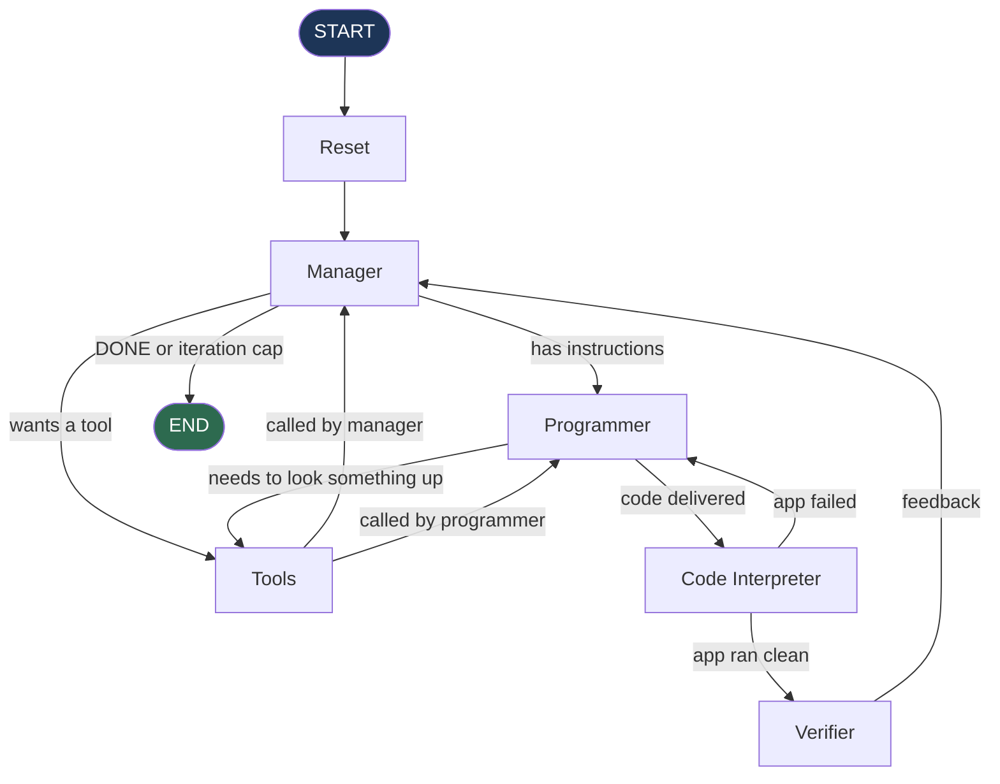

# Code Writer — a multi-agent Streamlit app generator

Describe an app in plain English; a team of LLM agents plans it, writes it, runs it in a
sandbox, reviews it, and hands back a working `dev.py`.

Built with **LangGraph** (orchestration), **OpenAI** (agents), **E2B** (sandboxed
execution), and **Tavily** (web search).

---

## How it works

The system is a stateful directed graph. A shared `GraphState` flows through every node,
accumulating messages, code, and feedback across iterations.



### The agents

| Node | Model | Job |
|------|-------|-----|
| **Reset** | — | Drops and recreates this session's code table |
| **Manager** | `gpt-5.4-mini` | Turns the request into instructions; asks the user questions; decides when it's done |
| **Programmer** | `gpt-5.4-nano` | Writes the code, or searches the web when it needs syntax help |
| **Code Interpreter** | — | Runs the app in an E2B sandbox and reports what broke |
| **Verifier** | `gpt-5.4-nano` | Reviews the code and sends critique back to the Manager |
| **Tools** | — | Dispatches tool calls and routes the result to whoever asked |

Models are set in [`coder_agents/config.yaml`](coder_agents/config.yaml).

### Tools

- `ask_human` — pauses the graph (via `NodeInterrupt`) and waits for the user's reply
- `save_py_file` — writes the newest code from the database out to `dev.py`
- `tavily_search` — lets the Programmer look up syntax and error messages

### Two design points worth knowing

**Code is checked by actually running the app, not by executing the script.** Running a
Streamlit script as plain Python gives it no `ScriptRunContext`, so Streamlit falls into
"bare mode": every `st.*` call becomes a no-op and whole classes of real bugs — duplicate
widget IDs, bad widget arguments — exit cleanly. The sandbox instead runs the app under
`streamlit.testing.v1.AppTest`, which executes it in a genuine script-run context. A
`compile()` pass runs first, because Streamlit's script runner swallows syntax errors
rather than surfacing them.

**The Programmer chooses between searching and delivering.** `with_structured_output`
pins `tool_choice` to the output schema, which would make the search tool unreachable.
So the `Code` schema is offered as one tool alongside Tavily and the model picks. Search
is capped at 3 rounds, after which it's forced to produce code.

---

## Setup

```bash
pip install -r requirements.txt
```

Create a `.env` file in the project root:

```
OPENAI_API_KEY=sk-...
TAVILY_API_KEY=tvly-...
E2B_API_KEY=e2b_...
```

All three are required — the app checks them at startup and stops with a clear message
if any is missing.

## Run

```bash
streamlit run app.py
```

Describe the app you want. The Manager will usually ask a clarifying question first;
answer it in the same chat box. When it's satisfied, a **Download dev.py** button appears.

---

## Output

Every browser session gets its own directory, so concurrent users never overwrite each
other:

```
sessions/<session_id>/
├── dev.py           the generated app
├── programmer.db    every code revision the Programmer produced
└── log.txt          full trace of the run
```

`log.txt` is the place to look when something goes wrong. It records each node with
timing, the messages sent to each LLM, every tool call and result, and each routing
decision:

```
[19:32:52.197] === MANAGER  (iteration 0) ==================================
[19:32:52.198]   entered from: start
[19:32:52.199]   sent to LLM (1):
[19:32:52.199]     [0] user     | Build a streamlit app that plots a CSV column.
[19:32:53.076]   output: ai     | CALL ask_human(question=Which CSV column...)
[19:32:53.092]   done in 0.90s
[19:32:53.092]   ROUTE  Manager -> Tools   (wants ask_human)
```

---

## Layout

```
app.py                     Streamlit UI and graph invocation
coder_agents/
├── workflow.py            graph wiring — nodes, edges, model binding
├── state.py               GraphState and the Code output schema
├── router.py              conditional edges; decides where each node goes next
├── manager.py             Manager node + history trimming
├── programmer.py          Programmer node + search loop
├── code_interpreter.py    E2B sandbox + AppTest harness
├── verifier.py            Verifier node
├── tool.py                tool definitions and the dispatch node
├── reset.py               per-session database setup
├── utils.py               session paths, SQLite access, logging
├── config.yaml            model names
└── system_prompts/        one .md file per agent
```

---

## Known limitations

- **The graph is terminal.** Once the Manager says `DONE`, that conversation is finished;
  further messages won't restart it. Start a new session for a new app.
- **`iterations` never resets** across a conversation. A long session eventually hits the
  50-iteration cap and stops.
- **Verification covers the initial script run only.** Bugs that need interaction to
  trigger — a crash inside a button callback — won't be caught.
- **Session directories accumulate.** Nothing cleans up `sessions/`.
